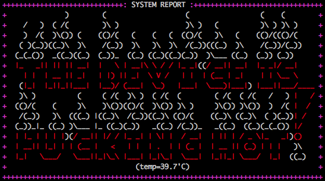

# HOT MOTD


 ** ~ Easy script for a nice MOTD ~ **

## Setup
Open /etc/profile and add this line at the bottom:
```bash
/directory/to/script/HotMotd.sh
```
You should also remove everything in the /etc/motd file.
When you have done that, open /etc/ssh/sshd_config and change
```
PrintLastLog yes
PrintMotd yes
```
with
```
PrintLastLog no
PrintMotd no
```
Modify /etc/pam.d/login and comment this line:
```
#session    optional   pam_motd.so
```
Then restart SSH with
```bash
sudo service ssh restart
```
And done!

## Now...
Test if it works. Login to your ssh server and, if you can see the MOTD, congrats!

If you don't see it, go through the steps again or read your OS's docs about SSH MOTDs or banners.

I appreciate any stars! Leave a pull request if you want to append or fix anything.
